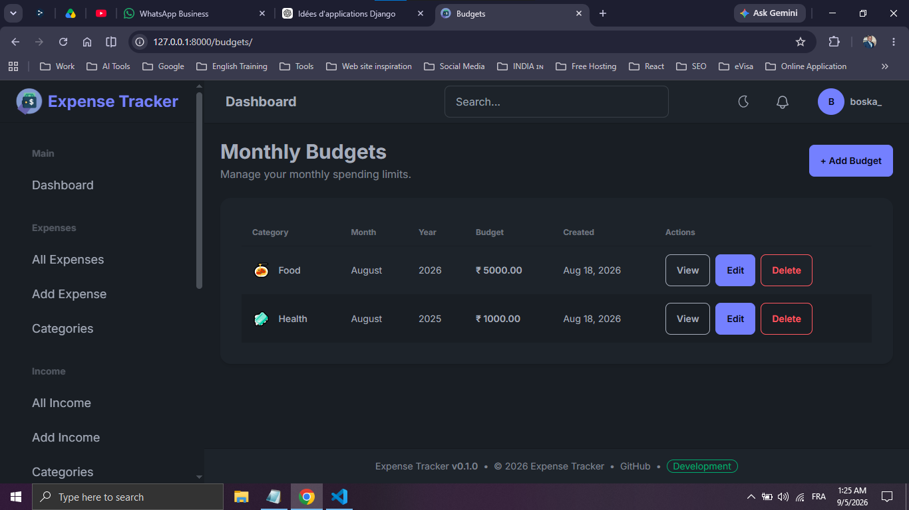
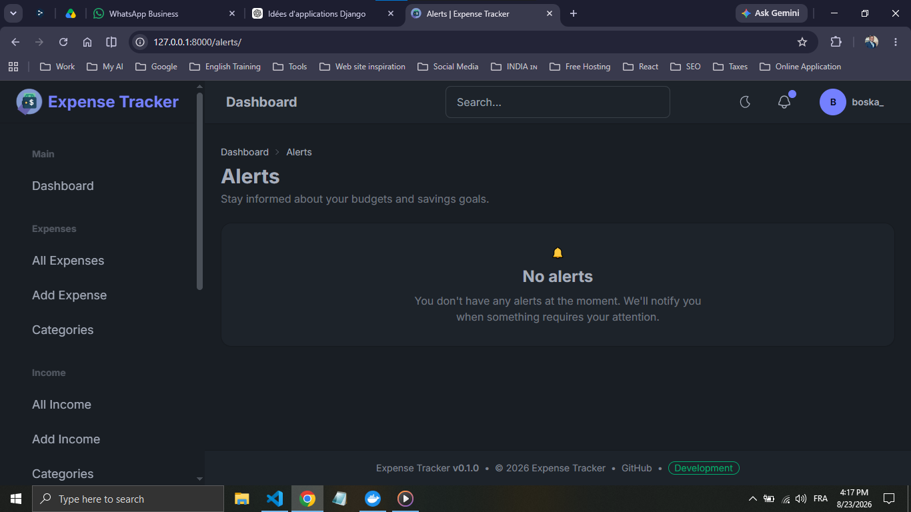
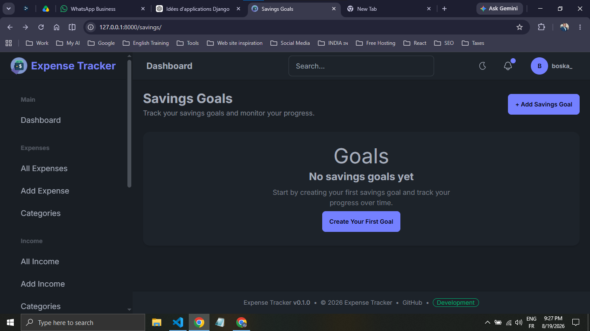
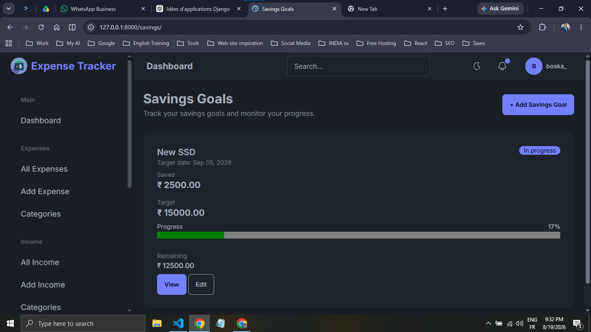
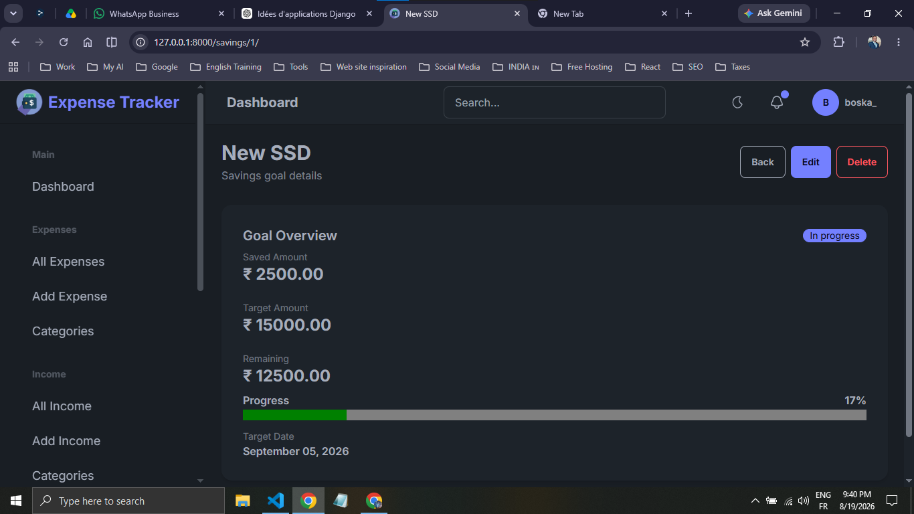
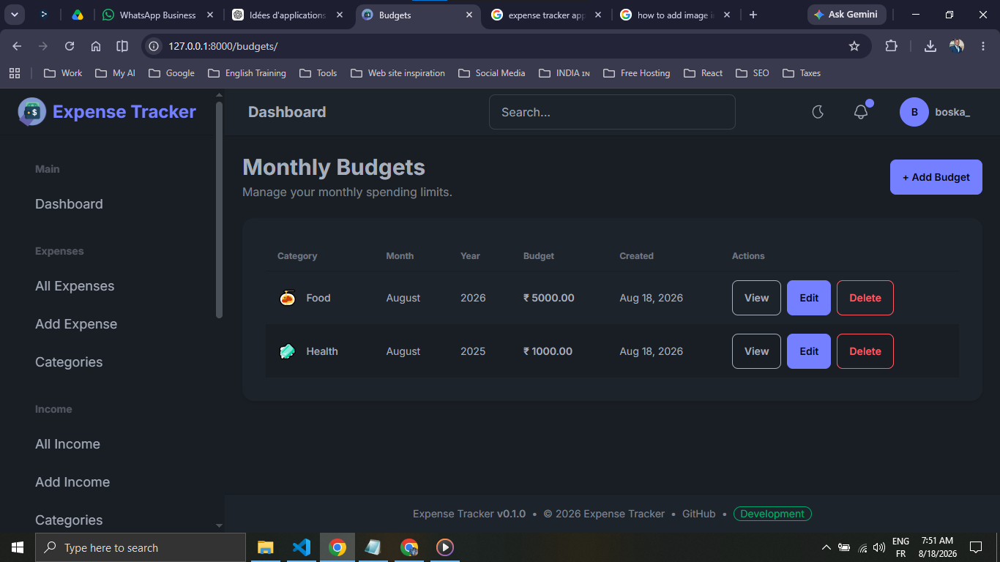
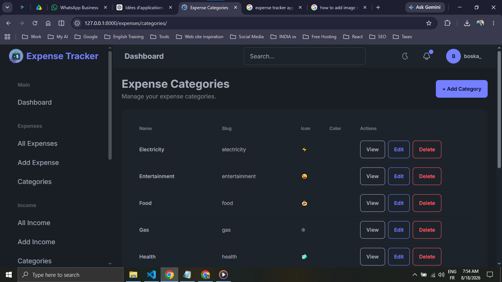
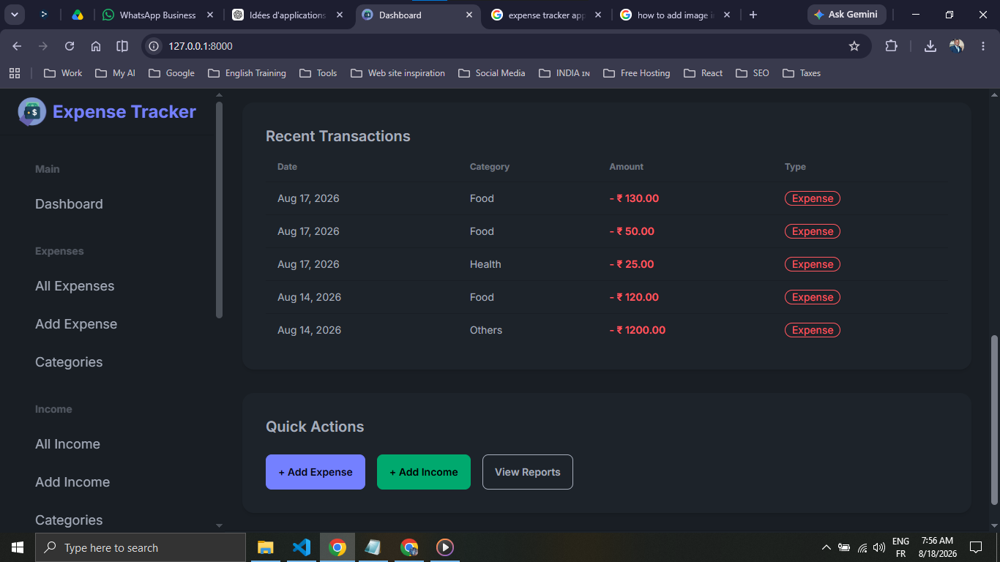

# Expense Tracker

A modern Expense Tracker built with Django.

## Tech Stack

- Django
- PostgreSQL
- Tailwind CSS 3.4.x
- DaisyUI 4.12.x
- Chart.js

## Features

- Expense Management
- Income Management
- Reports
- Dashboard
- Charts
- Authentication
- Responsive Design

## Screenshots

## Project Status

🚧 In Progress 65%
